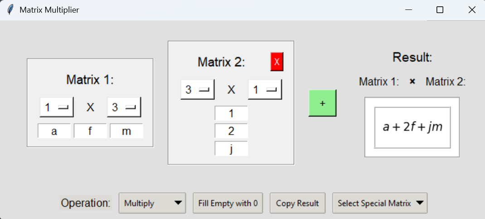

# Matrix Multiplier



## Overview
Matrix Multiplier is a sophisticated Python application providing both a web (Flask) and desktop (Tkinter) interface for creating, manipulating, and computing operations on numeric and symbolic matrices using Sympy. Results are rendered in a clean LaTeX-style format for superior clarity.

## Features
- **Dynamic Matrix Creation:** Effortlessly add or remove matrices.
- **Customizable Dimensions:** Adjust matrix size via intuitive dropdown menus.
- **Symbolic & Numeric Computation:** Seamlessly mix symbolic algebra with numerical precision.
- **Multiple Operations:** Multiply, add, subtract, transpose, or conjugate matrices.
- **Aesthetic Rendering:** Enjoy visually appealing LaTeX-style outputs.
- **User-Friendly Interfaces:** Both a web-based interface with Flask and a desktop GUI using Tkinter.
- **Improved Copy Functionality:** The "Copy Result" feature now extracts only matrix data in the proper dimensions.
- **Special Matrices:** Quickly insert matrices such as Pauli X, Pauli Y, Pauli Z, Hadamard, and CNOT.

## Detailed Updates
- **Web App Enhancements:**
  - Updated the copy function in the web interface so that it extracts and formats only the matrix values, avoiding extraneous output.
  - Grids automatically adjust to the correct dimensions when the result is copied.
- **Desktop GUI Enhancements:**
  - Improved “Copy Result” logic to fill new matrix entries with the previously computed result.
  - Enhanced error handling and layout improvements in the Tkinter interface.
- **General Improvements:**
  - Consistent styling across both interfaces.
  - Enhanced documentation and user guidance through real-time expression updates.

## Requirements

- Python 3.x
- [Flask](https://flask.palletsprojects.com/)
- [Tkinter](https://docs.python.org/3/library/tkinter.html)
- [Sympy](https://www.sympy.org)
- [Pillow (PIL)](https://python-pillow.org)
- [Matplotlib](https://matplotlib.org)

## Installation

Install the necessary packages using the requirements file:

```bash
pip install -r requirements.txt
```

## Usage

### Web Version
1. Run the Flask app:
   ```bash
   python app.py
   ```
2. Open your browser and navigate to `http://127.0.0.1:5000/`.
3. Create or modify matrices, then select an operation and click **Compute**.
4. Use the **Copy Result** button to extract the computed matrix into a new input panel.

### Desktop GUI Version
1. Run the Tkinter application:
   ```bash
   python matrix_multiplier.py
   ```
2. Enter or modify matrix values in the provided grids.
3. Select an operation from the dropdown and see the rendered result.
4. Use **Copy Result** to duplicate the result into a new matrix entry.
5. Special matrices can be inserted via the dropdown menu.

## License
This project is licensed under the MIT License.